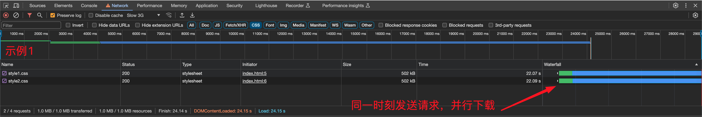
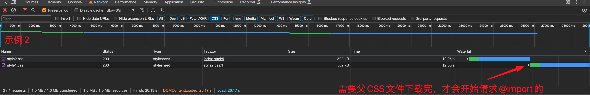

### 页面导入样式时，使用link和@import有什么区别？
#### 1. link

* link是HTML的标签，除了加载CSS外，还能定义RSS等其他事务，@import属于CSS的范畴，只能加载CSS

* link加载CSS时，多个文件之间是同时加载的，而使用@import会发送额外的http请求，并且需要等父CSS文件加载完才能继续加载@import导入的，在一个CSS中的多个@import也是可以平行加载，不过需要分别发送http请求

  * 示例：要求页面中导入两个很大的css文件 style1.css 和 style2.css

    * 使用两个link，代码如下，这种情况下，style1.css 和 style2.css是可以同时加载的，而无需等待style1.css下载完，具体加载流程如截图
    
    ```css
    /* style1.css (large css file) */
    
    .class1{
       /* rules */
    }
    ....
    .class1000{
       /* rules */
    }
    ```
    
    ```css
    /* style2.css (large css file) */
    .class1001{
       /* rules */
    }
    ....
    .class2000{
       /* rules */
    }
    ```
    
    ```html
    <!DOCTYPE html>
    <html lang="en">
    <head>
        <meta charset="UTF-8">
        <meta name="viewport" content="width=device-width, initial-scale=1.0">
        <link rel="stylesheet" href="style1.css">
        <link rel="stylesheet" href="style2.css">
        <title>Document</title>
    </head>
    <body>
        <header>link</header>
    </body>
    </html>
    ```
    
    
#### 2. @import
    
* 使用@import，这种情况下，style1.css 需要等待父CSS文件style2.css下载完才开始下载@import的style1.css ，具体加载流程如截图
    
    ```css
    /* style2.css (large css file) */
    @import url(style1.css);
    .class1001{
       /* rules */
    }
    ....
    .class2000{
       /* rules */
    }
    ```
    
    ```html
    <!DOCTYPE html>
    <html lang="en">
    <head>
        <meta charset="UTF-8">
        <meta name="viewport" content="width=device-width, initial-scale=1.0">
        <link rel="stylesheet" href="style2.css">
        <title>Document</title>
    </head>
    <body>
        <header>@import</header>
    </body>
    </html>
    ```
    
    

* 兼容性问题，link由于是XHTML标签，所以无兼容问题，而@import是CSS2.1提出的，低版本的浏览器不支持。

* link支持使用Javascript控制DOM去改变样式；而@import不支持。

#### 3. 几种使用CSS的方式

  * 链接样式

    ```html
    <link ref="stylesheet" type="text/css" href="style.css" >
    ```

  * 内联样式
    ```html
    <div style="display: none;background:red"></div>
    ```
  * 嵌入样式
    ```html
    <head>
    <style>
    .content {
        background: red;
    }
    </style>
    </head>
    ```
  * 导入样式
    ```html
    <head>
      <style>
        @import url(style.css);
      </style>
    </head>
    ```
    ```css
    @charset "utf-8";
    @import url(style.css);
    *{ margin:0; padding:0;}
    .notice-link a{ color:#999;}
    ```

  

